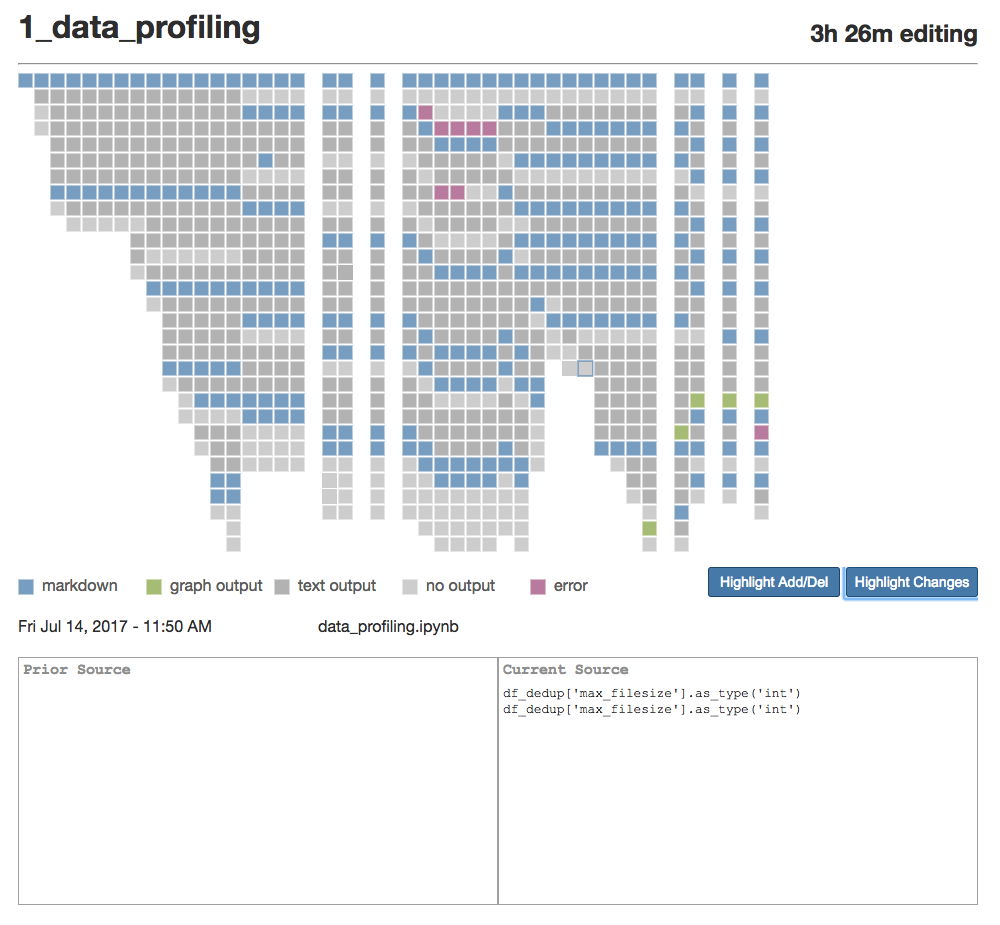

# nbcomet
nbcomet is a Jupyter Notebook extension that tracks Notebook history. It
consists of both a server side extension (.py) and a client-side nbextenion
(.js). Both must be installed for the tracking to work properly. 

## Installation
### 1. Install python package
For your convenience, nbcomet's server and nbextenion are contained in a single
python package that can be installed with pip. Simply run one of the following 
commands in your terminal:

 ```
 pip install nbcomet
 ```
 
 or if you prefer, you can download it with conda
 
 ```
 conda install -c adamrule nbcomet
 ```
 
**Note:** If you have multiple versions of python, make sure you download 
nbcomet onto the version of python you use to run your notebook server. You can 
check which version of python is running your notebook server by selecting the 
"Help > About" menu item in any running notebook. If this version is different 
from your default python version (e.g. what shows up when you run `python -v` in
 your Terminal), you can specify which version of python pip installs the the 
extension onto by modifying the pip command:

```
pip2.7 install nbcomet
pip3.5 install nbcomet
```

For more detailed assistance with loading Jupyter Notebook extensions, see the 
[Jupyter Extension documentation](http://jupyter-notebook.readthedocs.io/en/latest/examples/Notebook/Distributing%20Jupyter%20Extensions%20as%20Python%20Packages.html).

### 2. Configure server and notebook extensions
While nbcomet is now installed, you need to tell Jupyter to run it every time 
you run a notebook. You can use the following three commands to install and 
enable the notebook and server extensions:

```
jupyter nbextension install --py nbcomet
jupyter nbextension enable --py nbcomet
jupyter serverextension enable --py nbcomet
```

### 3. Check installation
You can check that nbcomet installed correctly by running:

```
jupyter serverextension list
jupyter nbextension list
```

### 4. Optional: Configure Data Directory
By default, Comet with store its data in `~/.jupyter/nbcomet`; You can change
this folder by editing the `notebook.json` configuration file in your
`~/.jupyter/nbconfig` folder to include a line specifying your data directory.
For example: `"Comet": {"data_directory": "/full/path/to/directory" }`.

## What Comet Tracks
Comet tracks how your notebook changes over time. It does so by:
1. tracking the occurrence of actions such as creating, deleting, moving, or executing cells
2. tracking how your notebook changes as a result of these actions

Comet tracks this information in three ways:
1. committing every notebook change to a local git repository
2. periodically saving a full version of the notebook
3. saving the name and time of every action to an sqlite database

Comet is a research tool designed to help scientists in human-computer interaction better understand how people use Jupyter Notebooks. It is primarily a recording tool with limited support for visualizing or reviewing the recorded data.

  
